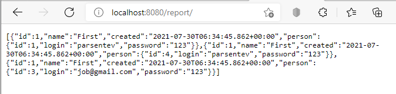
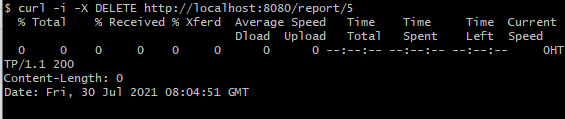

# job4j_rest

### Описание проекта
Первый ознакомительные проект с ***RESTful***. Spring boot имеет удобный ***механизм интеграции*** Rest сервисов. ***RestTemplate*** - позволяет осуществлять вызовы стороннего REST API для взаимодействовия между собой двух Rest сервисов.
Это простой сервис, который реализует только серверную часть.

### Used technologies
- Spring Boot as a web framework
- Spring Data as framework for data base
- Spring test for testing
- Maven as a build system
- PostgresSQL
- liquibase
- Travis C.I.
- Checkstyle

### Фукнции API
#### Employee:
- Получить всех сотрудников. GET: /employee/
- Получить сотрудникоа по id. GET: /employee/{id}
- Создать сотрудников. POST: /employee/
- Обновить сотрудников. PUT: /employee/
- Удалить сотрудников по id. DELETE: /employee/{id}
- Получение всех аккаунтов сотрудниа. GET: /employee/accounts/{idEml}
- Создать аккаунт сотрудника. POST: /employee/account/{idEml}
- Обновить аккаунт сотрудника. PUT: /employee/account/
- Получить аккаунт сотрудника по id. GET: /employee/account/{id},{idEml}
- Удалить аккаунт сотрудника по id. DELETE: /employee/account/{id}
#### Person:
- Получить всех пользователей. GET: /person/
- Получить пользователя по id. GET: /person/{id}
- Создать пользователя. POST: /person/
- Обновить пользователя. PUT: /person/
- Удалить пользователя. DELETE: /person/{id}

#### IntegrationController - интеграция с PersonController:
- Получить всех пользователей в виде отчета. GET: /integration/

  

- Создать пользователя в БД. POST: /integration/

  

- Обновить пользователя в БД. PUT: /integration/

  

- Удалить пользователя из БД. DELETE: /integration/{id}

  

